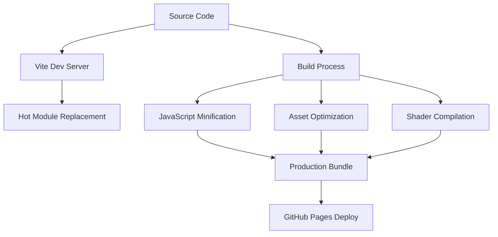
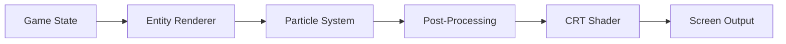
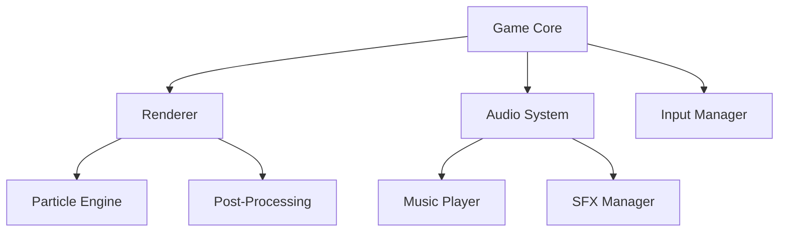

# Xenowar: The Battle for Earth
In the year 2150, Earth faced an unprecedented threat. Alien invaders from the distant galaxy of Xenos had launched a full-scale assault on our planet. These extraterrestrial beings, known as the Xenons, were relentless and technologically superior, leaving humanity on the brink of extinction.

As cities fell and hope dwindled, a group of elite pilots emerged from the shadows. These brave warriors, equipped with advanced fighter jets and cutting-edge weaponry, formed the last line of defense against the Xenon invasion. They called themselves the Guardians.

Among the Guardians was a young pilot named Alex, who had lost everything to the Xenons. Fueled by a desire for revenge and a determination to protect what remained of humanity, Alex took to the skies, ready to face the alien menace head-on.

The battle for Earth had begun, and the fate of humanity rested in the hands of the Guardians. This is the story of Xenowar.

## Overview
XENOWAR is a modern HTML5 Canvas-based space shooter game engine built with vanilla JavaScript, featuring a component-based architecture, particle systems, formation patterns, and dynamic audio management.

# XENOWAR Engine Documentation

## Build Pipeline and Development Flow



## Development Setup

### Prerequisites
```bash
# Required software
- Node.js 18+
- npm 9+
- Modern web browser with WebGL2 support

# Installation
npm install    # Install dependencies
npm run dev    # Start development server
npm run build  # Create production build
```

## Core Systems Architecture

### Rendering Pipeline


### CRT Shader System
```javascript
// Configurable shader parameters
{
  "scanline": {
    "intensity": 0.28,    // Scanline strength
    "count": 1024.0,      // Number of scanlines
    "rollingSpeed": 10.3  // Rolling speed
  },
  "screenEffects": {
    "vignetteStrength": 0.22,
    "brightness": 1.1,
    "curvature": 0.1
  }
}
```

## Asset Pipeline

### Image Processing
- Automatic sprite optimization
- Background texture processing
- Dimension verification
- Palette optimization
- Compression profiles

### Audio System
- Web Audio API integration
- Spatial audio support
- Dynamic music system
- Sound effect manager
- Audio pooling

## Performance Optimizations

### Memory Management
- Object pooling for particles
- Texture atlasing
- Asset preloading
- Garbage collection optimization
- Memory monitoring

### Rendering Optimizations
- WebGL2 acceleration
- Batch rendering
- Shader-based effects
- Double-buffered rendering
- Screen-space culling

## Technical Architecture

### Core Components


### Component Communication
- Event-based messaging
- Component lifecycle management
- State synchronization
- Update hierarchy
- Resource sharing

## Debug Features

### Performance Monitoring
```javascript
// Enable debug mode
engine.debug.enableProfiling();
engine.debug.showStats();
```

### Debug Commands
- `debug.showColliders()` - Show collision bounds
- `debug.showFPS()` - Display FPS counter
- `debug.profile()` - Start performance profiling
- `debug.showPoolStats()` - Display object pool stats

## Asset Requirements

### Sprites
- Format: PNG with transparency
- Dimensions: Power of 2 recommended
- Maximum size: 2048x2048
- Color depth: 32-bit RGBA

### Audio
- Format: MP3/M4A
- Sample rate: 44.1kHz
- Bit depth: 16-bit
- Channels: Stereo

## Build Configuration

### Development Build
```bash
npm run dev
# Starts development server with:
# - Hot module replacement
# - Source maps
# - Debug tools
# - Uncompressed assets
```

### Production Build
```bash
npm run build
# Creates optimized build with:
# - Minified JavaScript
# - Compressed assets
# - Dead code elimination
# - Bundled modules
```

## Performance Guidelines

### Best Practices
1. Use object pooling for frequent allocations
2. Batch WebGL draw calls
3. Minimize garbage collection
4. Pre-render static elements
5. Implement efficient collision detection

### Memory Management
- Monitor heap usage
- Implement dispose patterns
- Cache frequently used objects
- Clear unused resources
- Manage texture memory

## Contributing Guidelines

### Code Style
```javascript
// Use ES6+ features for modern JavaScript
class Component {
    constructor() {
        this.pool = new Pool();
    }
    
    update(deltaTime) {
        // Use object pooling
        this.pool.forEach(entity => {
            // Entity updates
        });
    }
}
```

### Pull Request Process
1. Fork repository
2. Create feature branch
3. Follow code style guide
4. Update documentation
5. Submit pull request
